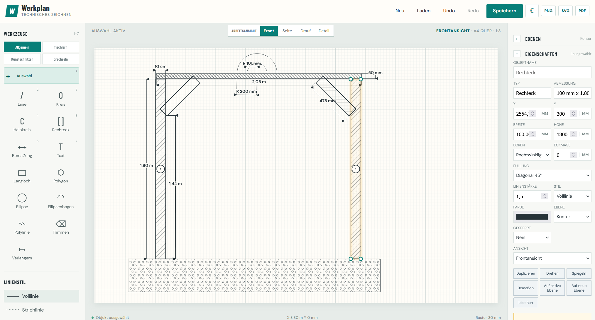

# Werkplan

Lokales Zeichenprogramm für technische Entwurfszeichnungen. Werkplan läuft vollständig offline im Browser und benötigt weder Installation noch Server.

## Start unter Windows 11

`Start-Zeichenprogramm.bat` doppelklicken oder `index.html` im Browser öffnen.

## Funktionsübersicht

- Technische Grundformen, Texte und Bemaßungen
- Objektfang mit End-, Mittel-, Schnitt-, Quadrant- und Tangentialpunkten
- Vier getrennte Arbeitsansichten mit eigenem Zoom und Maßstab
- Objekt- und achsenbezogene Richtmaße ohne Veränderung der Geometrie
- Ebenen, Mehrfachauswahl, Gruppen und Objektinspektor
- Materialliste mit Objektverknüpfungen
- Speicherung als `.werkplan` sowie Export als SVG, PNG und PDF

## Werkzeuge

### Auswahl (Werkzeug 1)
- **Objekt anklicken**: Wählt das Objekt aus und zeigt seine Eigenschaften
- **Ausgewähltes Objekt verschieben**: Mit der Maus auf dem Objekt halten und ziehen (Drag & Drop)
- **Eigenschaften bearbeiten**: Werte im rechten Panel ändern; die Änderung wird beim Verlassen des Feldes direkt übernommen
- **Objekt löschen**: "Auswahl löschen" Button klicken

Im Eigenschaftenbereich stehen zusätzlich exaktes Verschieben und Duplizieren, Drehen, horizontales und vertikales Spiegeln sowie rechteckige und kreisförmige Wiederholungen zur Verfügung. Linien können an Anfang oder Ende um einen festen Betrag getrimmt oder verlängert und an einer exakten Länge geteilt werden.

### Linie (Werkzeug 2)
Klicken und ziehen für eine gerade Linie.

### Kreis (Werkzeug 3)
Vom Mittelpunkt nach außen ziehen. Zielradius und Winkel können links exakt vorgegeben werden.

### Halbkreis (Werkzeug 4)
Vom Mittelpunkt zum Rand ziehen. Die Ausrichtung folgt dem gezeichneten Winkel.

### Rechteck (Werkzeug 5)
Klicken und ziehen für ein Rechteck.

### Bemaßung (Werkzeug 6)
Linie mit Beschriftung. Die Länge wird automatisch berechnet.

### Text (Werkzeug 7)
Klicken, Text eingeben, Enter zum Bestätigen.

### Weitere Formen

- **Langloch**: Mittellinie ziehen; die Breite kann über das exakte Höhenfeld vorgegeben werden
- **Polygon**: Mittelpunkt anklicken und Radius ziehen; die Seitenzahl wird links eingestellt
- **Fase / Abrundung**: Rechteck auswählen und unter Eigenschaften Eckenart und Eckmaß einstellen

### Füllungen und Schraffuren

Rechtecke können im Eigenschaftenbereich mit folgenden Füllungen versehen werden:

- Vollfläche schwarz
- Diagonal 45° und Diagonal -45°
- Kreuzschraffur
- Horizontale und vertikale Schraffur
- Punktraster
- Mauerwerk / Ziegel
- Beton

Die Muster werden identisch auf der Arbeitsfläche sowie im SVG-, PNG- und PDF-Export ausgegeben.

### Intelligentes Trimmen und Verlängern

**Trimmen** oder **Verlängern** wählen und eine Linie nahe dem zu bearbeitenden Ende anklicken. Werkplan sucht entlang der Linie die nächste Schnittkante und setzt das Ende automatisch dorthin.

## Ebenen

Werkplan besitzt die Ebenen **Kontur**, **Achsen**, **Bemaßung**, **Text** und **Hilfslinien**. Neue Objekte werden auf der aktiven Ebene angelegt. Pro Ebene stehen drei getrennte Schalter zur Verfügung:

- **S**: auf der Arbeitsfläche sichtbar
- **G**: gegen Auswahl und Bearbeitung gesperrt
- **D**: in SVG, PNG und PDF druckbar

Die Sichtbarkeit wird für jede Arbeitsansicht separat gespeichert. Hilfslinien sind standardmäßig nicht druckbar.

## Mehrfachauswahl und Gruppen

- Mit **Shift + Klick** Objekte zur Auswahl hinzufügen oder daraus entfernen
- Auf freier Fläche einen Auswahlrahmen aufziehen
- Ausgewählte Objekte gemeinsam ziehen, drehen, spiegeln, kopieren oder löschen
- Im Eigenschaftenbereich gruppieren oder eine Gruppierung aufheben
- Ein Klick auf ein gruppiertes Objekt wählt beim Verschieben die gesamte Gruppe

## Objektfang

Neben Endpunkt, Mittelpunkt, Schnittpunkt, Kante und Lotpunkt stehen Quadrant, Tangente, Verlängerung, Parallel und Senkrecht zur Verfügung. Bei richtungsabhängigen Fängen zeigt eine orange gestrichelte Hilfsspur den verwendeten Bezug. Der Fang ist bei allen geometrischen Zeichenwerkzeugen aktiv.

## Maßstab und Richtmaß

Rechts unter **Maßstab & Richtmaß** kann zwischen 1:1, 1:10, 1:20, 1:50, 1:100 oder einem eigenen Maßstab gewählt werden. Die Objekte werden immer in echten Millimetern gespeichert; der Maßstab steuert nur, wie viel davon auf dem Zeichenblatt sichtbar ist. Bei 1:20 entsprechen 100 mm auf dem Blatt 2.000 mm in der Planung.

Die Leiste oberhalb der Zeichenfläche zeigt das aktuelle Blattformat und die Orientierung dynamisch an, zum Beispiel **A3 quer**, **A4 quer** oder **A4 hoch**.

Die aktive Arbeitsansicht wird direkt in der Leiste oberhalb der Zeichenfläche umgeschaltet. Das farbig hervorgehobene Segment und die ausgeschriebene Bezeichnung zeigen jederzeit, ob gerade Frontansicht, Seitenansicht, Draufsicht oder Detail bearbeitet wird.

Jede Ansicht speichert ihren eigenen Zoom, Bildausschnitt, Darstellungsmaßstab und ihre Ebenensichtbarkeit. Unter **Blattposition der aktiven Ansicht** können X und Y für die freie Positionierung dieser Ansicht im Export festgelegt werden. Leere Felder verwenden die automatische Anordnung.

### Ein Richtmaß setzen

1. Eine Linie, Bemaßung oder ein Rechteck auswählen.
2. Bei einem Rechteck **Breite** oder **Höhe** als Bezugsachse wählen.
3. Im Bereich **Richtmaß der aktuellen Ansicht** die gewünschte reale Länge eintragen, zum Beispiel `1800 mm`.
4. **Übernehmen** klicken.

Ein Richtmaß kalibriert das Koordinatensystem der aktuellen Arbeitsansicht. Die bereits gezeichneten Formen werden dabei nicht verändert; alle Maßanzeigen und späteren exakten Eingaben derselben Ansicht verwenden jedoch gemeinsam das festgelegte Verhältnis:

- Eine bekannte gezeichnete Strecke wird auf den eingegebenen Realwert kalibriert.
- Alle Bemaßungen der Ansicht verwenden danach denselben Faktor.
- Exakte Längen, Rechteckbreiten und Rechteckhöhen werden automatisch in dieses Koordinatensystem zurückgerechnet.
- Eigenschaften, Objektliste, Materialabmessungen und Mengenberechnung zeigen reale kalibrierte Maße.
- Andere Arbeitsansichten besitzen weiterhin eine eigene Kalibrierung.

Objektform und gespeicherte Rohkoordinaten bleiben beim Setzen des Richtmaßes unverändert. Der Ansichtsmaßstab wird automatisch gegenläufig angepasst, sodass Bildausschnitt und sichtbare Objektgrößen beim Klick auf **Übernehmen** nicht springen. Neue exakte Eingaben und alle Bemaßungen verwenden danach das kalibrierte Koordinatensystem; ein 1,8-m-Objekt erscheint im Vergleich korrekt etwas kürzer als ein anschließend erzeugtes 2-m-Objekt. Über **Richtmaß dieser Ansicht entfernen** wird wieder das unkalibrierte Koordinatensystem verwendet, ebenfalls ohne sichtbaren Sprung.

Für ein Objekt in einer anderen Arbeitsansicht zuerst oberhalb der Zeichenfläche auf **Front**, **Seite**, **Drauf** oder **Detail** wechseln und dort das betreffende Objekt auswählen.

## Navigation

- **Mausrad**: Um die Cursorposition zoomen
- **Mittlere Maustaste ziehen**: Zeichenfläche verschieben
- **Leertaste und linke Maustaste ziehen**: Zeichenfläche verschieben
- **Alles**: Alle Objekte der aktiven Ansicht einpassen
- **Auswahl**: Das ausgewählte Objekt einpassen

## Helles und dunkles Design

Das Sonnen-/Mondsymbol in der Kopfzeile schaltet zwischen hellem und dunklem Design um. Beim ersten Start übernimmt Werkplan die Systemeinstellung des Browsers; eine manuelle Auswahl wird lokal gespeichert und beim nächsten Öffnen wiederhergestellt.

Im dunklen Design werden Kopfzeile, Seitenleisten, Werkzeugflächen, Formulare, Kontextmenü und Befehlssuche abgedunkelt. Die Zeichenfläche erhält einen neutralen grauen Hintergrund mit angepasstem Raster und dunklen Maßtexten. SVG-, PNG- und PDF-Exporte bleiben unabhängig vom Oberflächendesign hell.

## Befehlssuche

Mit `Strg + K` öffnet sich die Befehlssuche. Sie enthält:

- alle Zeichen- und Bearbeitungswerkzeuge
- Wechsel zwischen Front-, Seiten-, Drauf- und Detailansicht
- Aktivieren einer Ebene
- Neu, Laden, Speichern, Rückgängig und Wiederholen
- SVG-, PNG- und PDF-Export
- Zoom- und Einpassen-Befehle
- Rasteranzeige und Rasterfang

Nach dem Öffnen direkt tippen, mit Pfeil hoch/runter wählen und mit `Enter` ausführen. `Esc` oder ein Klick außerhalb schließt die Suche.

## Projektwarnungen

Der Bereich **Projektwarnungen** im rechten Panel prüft laufend:

- Bemaßungen mit Verweis auf ein gelöschtes Objekt
- Objekte auf einer gesperrten Ebene
- Objekte auf einer nicht druckbaren Ebene
- Ansichten, die durch eine manuelle Blattposition teilweise außerhalb des Exportblatts liegen
- Materialpositionen mit Verweis auf ein gelöschtes Objekt

Die Zahl im Abschnittskopf zeigt die Anzahl gefundener Probleme. Ein Klick auf eine objekt- oder ansichtsbezogene Warnung öffnet das betroffene Element. Bei fehlenden Materialobjekten bleibt die verwaiste ID in der Materialliste sichtbar, bis eine neue Verknüpfung gewählt oder die Position korrigiert wird.

## Speichern und Export

Ein Stern vor dem Fenstertitel zeigt ungespeicherte Änderungen an. Mit `Strg + S` oder **Speichern** wird eine `.werkplan`-Datei erzeugt. Das aktuelle Dateiformat ist Version 13 und unterstützt Ebenen, Gruppen, neue Grundformen, getrennte Ansichtseinstellungen, sprungfreie kalibrierte Koordinatensysteme sowie gespeicherte Exportmaßstäbe.

Beim Export werden nicht druckbare Ebenen ausgelassen. Die ersten sechs Materialpositionen erscheinen auf dem Zeichnungsblatt; alle weiteren Positionen verteilt Werkplan automatisch auf zusätzliche PDF-Seiten.

Sind mehrere Ansichten aktiviert, berechnet Werkplan den kleinsten gemeinsamen ganzzahligen Exportmaßstab, der für alle Ansichten in ihre jeweiligen Blattbereiche passt. Ein ungeeigneter manueller Arbeitsmaßstab beeinflusst den Export nicht mehr. Die druckbaren Inhalte erhalten einen adaptiven Rand und werden in ihrem Bereich zentriert. Jede Ansicht wird zusätzlich auf ihren Blattbereich begrenzt, sodass Geometrie und Bemaßung nicht über den Blattrahmen oder in das Schriftfeld laufen.

### Exportmaßstab selbst festlegen

Unter **Maßstab & Richtmaß → Exportmaßstab** stehen folgende Möglichkeiten zur Verfügung:

- **Automatisch einpassen**: Werkplan berechnet den kleinsten gemeinsamen Maßstab, bei dem alle aktivierten Ansichten vollständig passen.
- Voreinstellungen von Vergrößerungen `10:1`, `5:1`, `2:1` bis zu Verkleinerungen wie `1:100`.
- **Benutzerdefiniert**: Ein beliebiger Nenner kann eingegeben werden. Werte kleiner als `1` erzeugen Vergrößerungen, zum Beispiel `0,5` für `2:1`.

Der Exportmaßstab gilt gemeinsam für alle aktivierten Ansichten, damit Größen direkt vergleichbar bleiben. Ist ein manuell gewählter Maßstab zu groß für den verfügbaren Blattbereich, zeigt die Projektprüfung den mindestens benötigten Wert an. Der gewählte Wert wird trotzdem verwendet; die Ansichtsgrenzen schützen Blattrahmen und Schriftfeld vor Überläufen.

## Objektinspektor und Kontextmenü

In der Objektliste kann nach Name oder Typ sowie nach Ansicht und Ebene gefiltert werden. Objekte lassen sich dort sichtbar oder unsichtbar schalten, sperren, auswählen und anhand ihrer Material- oder Bemaßungsverknüpfungen prüfen. Objektname, Ebene und Sperre sind direkt in den Eigenschaften editierbar.

Ein Rechtsklick auf ein Objekt öffnet Befehle für Kopieren, 90-Grad-Drehung, Spiegelung, Schnellbemaßung, Materialzuordnung und Löschen. Unter **Kopie einfügen in** kann die aktuelle Einzel- oder Mehrfachauswahl direkt in die Frontansicht, Seitenansicht, Draufsicht oder Detailansicht kopiert werden. Werkplan übernimmt dabei den Darstellungsmaßstab der Quellansicht und rechnet die Modellkoordinaten auf die Kalibrierung der Zielansicht um. Dadurch bleiben reale Maße, Position und sichtbare Größe gleichzeitig erhalten. Ebene und verknüpfte Bemaßungen werden mitkopiert. Die Zielansicht wird danach automatisch geöffnet.

Die verwendeten Schriften liegen als WOFF2-Dateien im Ordner `fonts`. Werkplan benötigt deshalb auch für die Typografie keine Internetverbindung. Die zugehörigen OFL-Lizenztexte befinden sich im selben Ordner.
